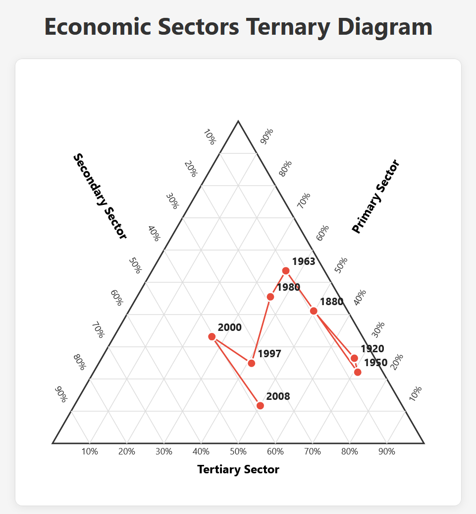

# Sector triangle for Indonesia
Interactive Sector triangle for for primary, secondary and tertiary economic sectors of Indonesia. The threshold between the rendered years is adjustable (higher threshold, less years) and specific years can be fixed to be always rendered, regardless of the threshold. You can click the the years to see their underlying values, which where derived from the source.

Link: [https://kai-raschke.github.io/indonesia-sector-triangle/](https://kai-raschke.github.io/indonesia-sector-triangle/)

## Sector triangle
How to read (de/German): https://www2.klett.de/sixcms/media.php/229/dreieck.pdf

## Data used from
The sources of long-term economic growth in Indonesia, 1880–2008, Pierre van der Eng (2009)

## License
MIT
